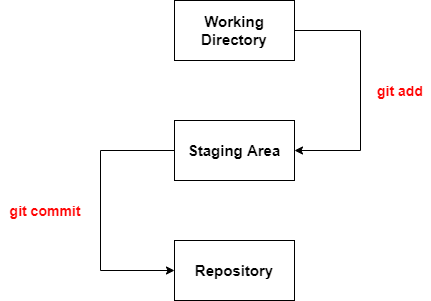
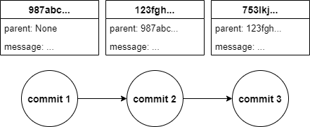
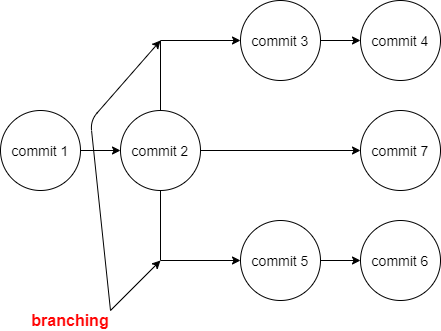
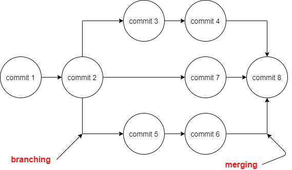

<h1 align="center">My Git Book</h1>
<h6 align="center">Commands and reminders</h6>

---


- ##### Original Git Book
[](https://git-scm.com/book/en/v2)

- **[What is git?][df1]** Git is a free and open source distributed version control system.

[//]: # (Comment: Just learning Markdown 😁 )

---

## 1. List of commands
#### In my opinion the most used in the daily basis

| Command &emsp;&emsp;&emsp;&emsp;&emsp;&emsp;&emsp;&emsp;&emsp;&emsp;&emsp;| Description |
| ------ | ------ |
| git init | initialization of a git repository (repo) in the current directory  |
| git status | reports the status of the repo |
| git add . | adds file(s) to the staging area|
| git commit -m | commits the file(s) that are in the staging area to the repo, with a specific message that was to be added with ""|
| git log (--oneline) | --oneline represents an optional subcommand to show the log messages in oneline; log, lists all the changes (commits) made in the repo|
| git commit --ammend | allows to change the last made commit, the commit message or the the files that were added or changed  |
| git branch | lists the existing branch's in the repo |
| git branch branch_name | creates a branch from the branch we currently are without changing the HEAD pointer, we stay in the branch we are right now |
| git switch branch_name / git checkout branch_name| changes the current branch to the branch_name we put in the command (changes the pointer HEAD)|
| git switch - c branch_n / git checkout -b branch_n | creates a new branch and changes at the same time the HEAD pointer to the branch we just create |
| git branch -d / git branch -D / git branch -m new_n| -d -> deletes a branch; -D -> force delete to a branch; -m -> changes the name to the currently branch|
| git diff | lists all the changes from staging area to work directory, only if they are in the unstaged area of the repo |
| git diff HEAD | lists all the changes from staged and unstaged area of the repo |
| git diff --staged | list all the changes already staged |
| git diff branch1_n..branch2_n | list all the changes from branch1 to branch2 |
| git diff commit1_id..commit2_id | lists all the changes between two commits |
| git stash | stashes all the uncommitted changes in the current branch |
| git stash pop | removes from the stash all the stashed changes |
| git stash list | lists all the stashed changes |

---

## 2. Basic UNIX commands
This UNIX commands can be helpful if we work in the git bash directly instead of a service that use's git.

| Command | Description |
| ------ | ------ |
| ls | lists all the files and directory's of the current directory |
| ls -a | lists all the files and directory's including hidden files/directory's of the current directory |
| clear | cleans the terminal |
| pwd | print's the current work directory |
| cd directory_name | change us from the current directory to the directory_name |
| cd .. | get us back on directory from the directory path |
| start . | open's the GUI (Graphical User Interface) of the current directory for Windows |
| open . | open's the GUI (Graphical User Interface) of the current directory for Mac/Linux |
| touch file_name | creates a file |
| mkdir dir_name | creates a directory with the dir_name name |
| rm -rf dir_name | removes a directory called dir_name |
| rm file_name | removes a file or files permanently |

---

## 3. Configure Git

* Configure the username in git associated to the repo's:
```sh
git config --global user.name "name"
```
* Configure the email associated to the user:
```sh
git config --global user.email email@email.com
```
* Configure the git editor:
```sh
git config --global core.editor <code>`
```

---

## 4. Graphical User Interface for Git
GUI for Git is not only reliable, efficient, visually pleasing and stylish to use, it also makes Git operations more understandable and enjoyable. Its interface is intuitive, as it allows users to quickly perform basic actions. It even has a drag and drop feature to make your life easier. More than that, you can easily fix errors with just one click. Here are some of the GUI's for Git:
* GitKraken (recommended)
* GitHub Desktop
* Source Tree
* Tower
* Ungit

---

## 5. The process of Committing

Here's a workflow to represent the process of committing:



In the image below it is represented a image to exemplify the structure of various commits in one branch of a repo.



---

## 6. Ignoring files
Git ignore's everything inside the .gitignore file.
<br />
E.g.:
* .DS_Store -> ignores every file with the extension DS_Store
* foldername/ -> ignores the entire folder
* .log -> ignores every file with the extension .log

---

## 7. Branching

Here's a workflow to represent the process of branching:



In the image above we can see that from commit 2, the tree starts having more than just 1 branch to have 3 branches.

---

## 8. Merging

Here's a workflow to represent branching and merging, because there's no merging without a "little" branching before:



In the above image we can see two operations of merging, from commit 4 to commit 8 and commit 6 to commit 8 again, that is, a merge from the two branches existing in the tree to the branch master (also called main).

---
